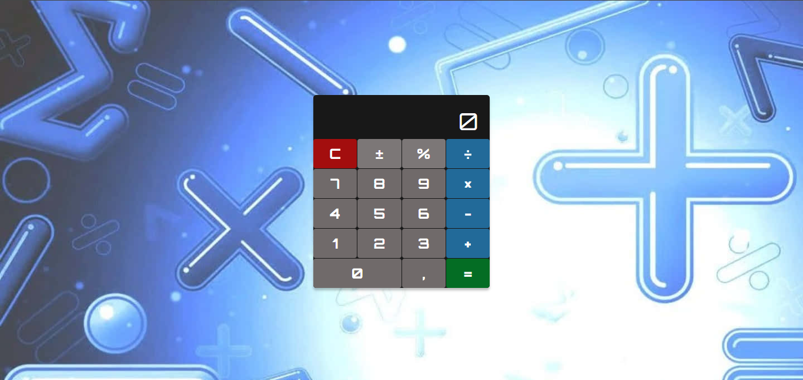

<h1>Calculadora Js</h1>

Mais um projeto  
Hoje gostaria de compartilhar com vocês um projeto que desenvolvi com a ajuda do curso DevClub. Trata-se de uma calculadora simples interativo usando JavaScript. 

Recentemente, concluí esse projeto de JavaScript no DevClub. Um dos projetos que fiz durante o curso foi uma calculadora simples. Este projeto foi uma ótima oportunidade para aprender e praticar conceitos importantes do JavaScript, como:

ForEach: O forEach() é um método que itera sobre um array e executa uma função para cada item do array. Usei o forEach() para iterar sobre os botões da calculadora e capturar os eventos de clique.

Function-Return: O return é uma palavra-chave que é usada para retornar um valor de uma função. Usei o return para retornar o resultado de uma operação matemática.

Switch-Case: O switch-case é uma estrutura de controle que é usada para escolher uma ação com base no valor de uma expressão. Usei o switch-case para determinar qual operação matemática deve ser realizada com base no botão que foi clicado.

O código da calculadora é relativamente simples. O HTML e o CSS são usados para criar a interface da calculadora. O JavaScript é usado para capturar os eventos de clique dos botões e realizar as operações matemáticas.

<h4>Aqui está um resumo dos passos para criar uma calculadora com JavaScript:</h4>   
<ul>
        <li>Crie o HTML e o CSS da interface da calculadora.</li>
        <li>Crie uma função para capturar os eventos de clique dos botões.</li>
        <li>Use o forEach() para iterar sobre os botões da calculadora.</li>
        <li>Use o return para retornar o resultado de uma operação matemática.</li>
        <li>Use o switch-case para determinar qual operação matemática deve ser realizada.</li>
</ul>

>Calculator: https://daliosy.github.io/calculadora/

<h2>Habilidades recentes:</h2>

Aprendi ForEach, Function-Return, Switch-Case no JavaScript.

<h2>Contato:</h2>

> Linkedin: https://www.linkedin.com/in/dalio-s-yamada/

> Github: https://github.com/DalioSY/calculadora

#HTML #CSS #JavaScript #Programação  #Dev #Desenvolvedor-Web #DesenvolvedorFrontEnd #DesenvolvedorFullStack #TransiçãoDeCarreira #Oportunidades #DisponívelParaTrabalho #Calculadora

